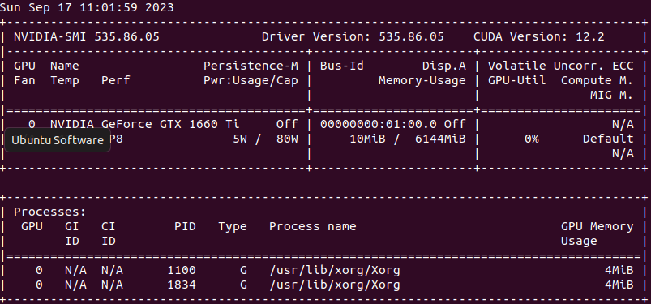
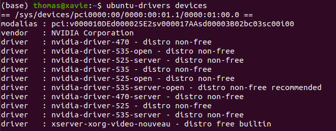
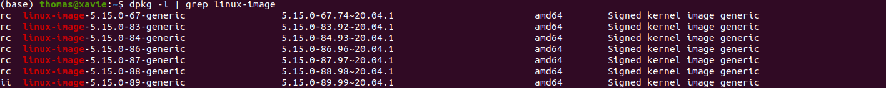

### I. Installation Procedure 
### 1. Prepare devices:
- You are on *Windows*, you'll need:
  + An 8GB or larger USB drive.
  + An Ubuntu ISO file. Access [Download Ubuntu](https://ubuntu.com/download/desktop) for details.
  + Download [Rufus](https://rufus.ie/en/) to create USB boot.
- Create USB boot which contains ...
### II. After installation
### 1. NVIDIA-SMI has failed because it couldn't communicate with the NVIDIA driver (Software & Update).
#### Problems
- This issue happens when your computer can not detect or communicate with Nvidia driver.
- This could lead to that we can not use our GPU even having.
#### Reasons
- In installation phase, Nvidia driver was disabled.
- Running with Nouveau Graphics Card.
#### Solutions
1_1. Access <strong> Software & Update </strong>, choose <strong> Additional Drivers </strong>. Then choose <strong>NVIDIA Driver Metapackage ... (priorietary)</strong>. Then enter <strong> Configrating Boot Password </strong>, reboot.   
1_2. In boot menu, choose <strong> Enroll MOK </strong>, type the key already created when installing Nvidia driver, continue.   
/   
2. In case the 1st Solution can not solve the problem. Try the ways mentioned in the link below.   
https://askubuntu.com/questions/927199/nvidia-smi-has-failed-because-it-couldnt-communicate-with-the-nvidia-driver-ma  
/   
3. In case after installing Nvidia drivers, then **reboot**, you can not boot into kernel anymore, check this secret repos xD :  
```
git clone https://github.com/NU-iz-da-fam/nvidia-driver-kernel-boot-issue
```
/
Sometimes, up to the devices, they might <strong>NOT</strong> require Configurating Boot Password. Just need to restart the device, then changes will be applied.   
```
sudo reboot
```
#### Check result
```
nvidia-smi
```
After entering this command, if "NVIDIA-SMI has failed because it couldn't communicate with the NVIDIA driver" does not appear or display as the picture below, it's okay.   

- Tested devices: ASUS TUF GAMING A17(AMD Ryzen), LEGION 5(AMD Ryzen), MSI(Intel)

### 2. Install Nvidia Driver with command lines
If you don't want to install with <strong>Software and Update</strong> app, you could use command line to install Nvidia Driver.
- Firstly, check the drivers that suit your OS or recommended drivers you should use. Your terminal response may vary with image below
```
ubuntu-drivers devices
```
   
- Assume you want to install <strong>nvidia-driver-535</strong>, use the below commands.
```
sudo apt install nvidia-driver-535
sudo reboot
```
#### Check result 
- Check see it any nvidia-drivers have been installed.
  ```
  dkms status
  ```
- Check Nvidia Drvier communication
  ```
  nvidia-smi
  ```
### 3. Uninstall Nvidia drivers (use Nouveau)
- Because of some reasons, if you don't want to use Nvidia Drvier or your application is not compatible with Nvidia Drvier, we have to remove it.
- I would like to say thanks to this post https://askubuntu.com/questions/206283/how-can-i-uninstall-a-nvidia-driver-completely, extremely useful in this case. This <strong> 3. Uninstall Nvidia drivers </strong> is
based on this post and some my own experience.
- If you want to remove everything related to Nvidia Driver, do this:
```
sudo apt-get remove --purge '^nvidia-.*'
```
```
sudo apt remove --purge '^libnvidia-.*'
```
- In some cases, nvidia package also include the dependencies the ```ubuntu-desktop``` package. So, you should also give the installation command for ```ubuntu-desktop``` package
```
sudo apt-get install ubuntu-desktop
```
- Sometimes, your OS will not include ```xorg.conf``` in /etc/X11, but if it exits, remove it
```
sudo rm /etc/X11/xorg.conf
```
That's all. So now, we completely uninstall Nvidia Drivers.
- [WARNING] In the post, it offer one more line to make sure we use Nouveau Graphics.
```
echo 'nouveau' | sudo tee -a /etc/modules
```
- But in my case, I don't use it. Because later, if I want to reinstall Nvidia Drivers, I face error ```pk-client-error-quark``` and can not install Nvidia Drivers
- If you use the above command, it's all okay, but later, I suggest you to type the below command before installation of Nvidia. This will unload Nouveau Graphics and ready install new graphics cards.
```
modprobe -r nouveau
```
### 4. Can't Boot into kernel
- <strong>Nvidia Problems</strong>:
  + You worked properly before, but after installing new nvidia drivers, you can not boot into kernel again. -> Uninstall all the things related to Nvidia Drivers.
  + At <strong>Boot Screen</strong>, press Esc + F2 (or which based on your PC/Laptop) to go into GRUB Menu.
  + Access to <strong>Recovery Mode</strong> of your kenel, go to <strong>root</strong>. Type the command:
  + Now you will boot into kernel using Nouveau Graphics -> This works for me all the time.
  ```
  sudo apt-get remove --purge '^nvidia-.*'
  sudo reboot
  ```
  + Or you can install nvidia driver and boot again. 
  ```
  sudo apt-get remove --purge '^nvidia-.*'
  sudo apt install nvidia-driver-535
  sudo reboot
  ```
- <strong>Blacklist Nouveau</strong>:
  + If you already uninstalled all the thing involved to Nvidia drivers but you still can not boot into the kernel, make sure that you do not <strong>blacklist nouveau</strong> graphics card in ```/etc/modprobe.d/```
  + If yes, remove it and reboot.
  ```
  sudo rm blacklist-name.conf
  ```
  ```
  sudo reboot
  ```
### 5. Remove Old Unused Kernels
- You have installed lots of kernels, and some of them are outdated. You should remove them to have more free space or avoid booting into wrong kernels.
- Check all installed kernels in your OS. And confirms which images should be deleted.
```
dpkg -l | grep linux-image
```
 
- Assume you want to remove ``` linux-image-5.15.0-67-generic ```, use command:
```
sudo apt-get purge linux-image-5.15.0-67-generic
```
- Or this command, up to you.
```
sudo apt-get remove linux-image-5.15.0-67-generic
```
- If you want to remove many old kernels, consider to use below commands, it will not affect our current kernel.
```
sudo apt-get autoremove
```
- If your deleted kernels are still in ```grub.cfg``` before being removed. You should update grub to make changes
```
sudo update-grub
```
```
sudo update-initramfs -u -k all
```
